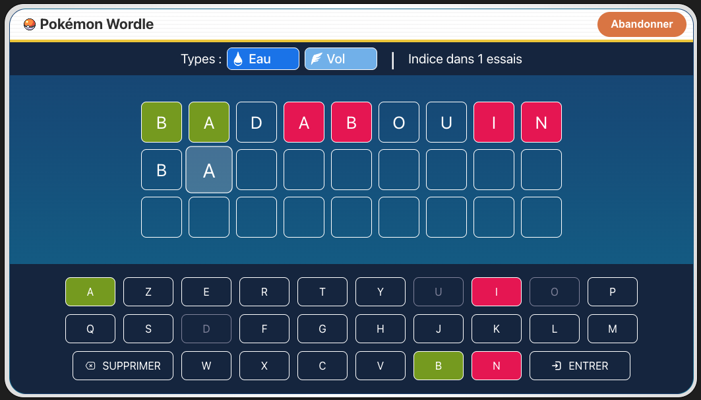
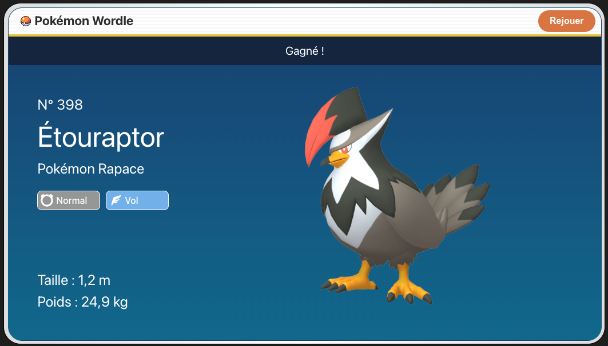

# Pokémon Wordle

## Introduction

<div align="center">
  
  
</div>

A game where you have to guess the name of a Pokémon.

Inspired by the game [Wordle](https://www.nytimes.com/games/wordle/index.html).

The game can be played [here](https://demarbre1u.github.io/pokemon-wordle/).

## How to run locally

```bash
git clone git@github.com:demarbre1u/pokemon-wordle.git
cd pokemon-wordle/
npm i
npm run dev
```

## How to update the game data

Use the script `./tools/pokemon-helper.js` as follow :

```
Usage: pokemon-cli [options] [command]

CLI to fetch and build the game data for Pokémon Wordle

Options:
  -V, --version    output the version number
  -h, --help       display help for command

Commands:
  fetch [options]  Fetches the game data
  build [options]  Builds the game data
  help [command]   display help for command
```

## Credits

The data used are from the [PokéAPI](https://api-pokemon-fr.vercel.app/).
